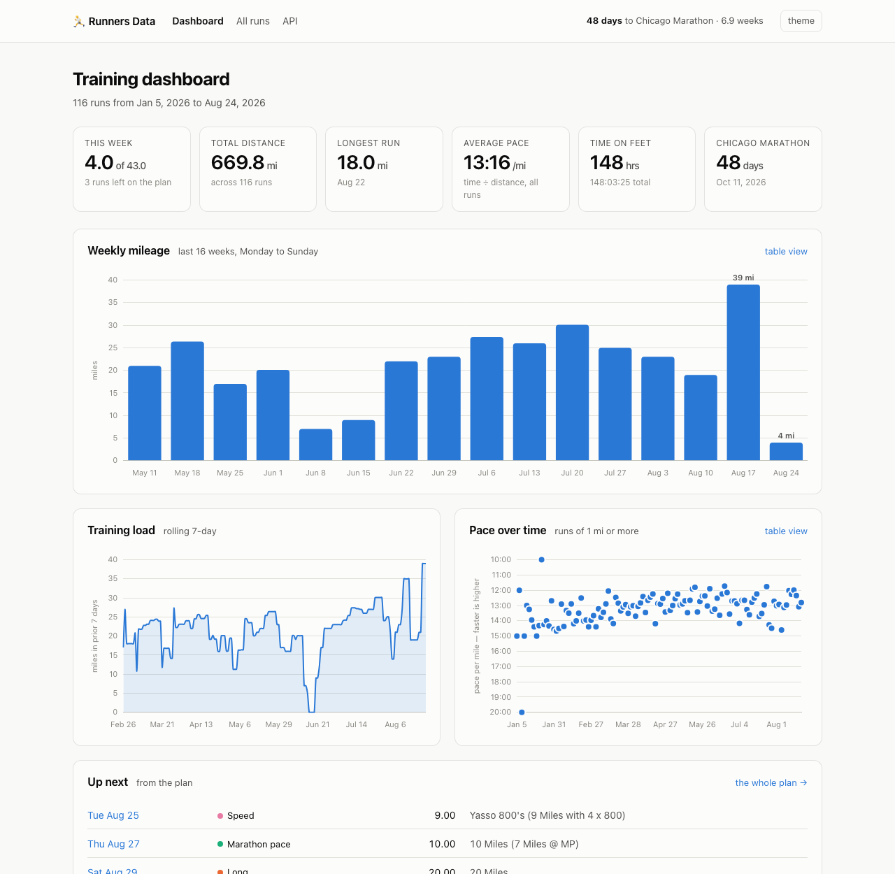

# Runners Data

A local web app for browsing your marathon training log. Export your spreadsheet
to CSV, ingest it, and browse it at `http://localhost:8000` in a Docker container
that never talks to the outside world.



## Quick start

0. **One-time setup** (creates `.venv` and installs dependencies):

   ```sh
   make venv
   ```

1. **Export the sheet.** In Google Sheets: *File → Download → Comma Separated
   Values (.csv)*. Save it into `data/`.

2. **Check the column detection** (writes nothing):

   ```sh
   make inspect
   ```

   It prints which of your headers it matched to each field and shows the first
   few parsed rows. If something is mapped wrong, see *Column mapping* below.

3. **Load it, then start the app:**

   ```sh
   make ingest
   make start       # → http://localhost:8000
   ```

If you'd rather not have a local Python at all, skip `make venv`, run `make start`
first, and then `make ingest-docker` — the loader runs inside the container.

Re-exporting the sheet later? Drop the new CSV in `data/` and run `make ingest`
again — rows are matched on date, so re-importing updates in place instead of
duplicating. `make ingest ARGS=--replace` wipes the spreadsheet rows first if the
sheet's structure changed substantially.

## Optional configuration

Copy `.env.example` to `.env` to set your goal race, which turns on the
countdown in the header and a dashboard tile:

```sh
RACE_NAME=Chicago Marathon
RACE_DATE=2026-10-11
```

## Sheet shapes

Two layouts are recognized, picked per file automatically.

### A week-per-row training plan

One row per training week, a column per weekday, weekly totals at the end —
the shape a Nike Run Club style plan exports as:

```
Week | Date | Monday | Time | Tuesday | Time | Wednesday | Thursday | Time | ... | Weight | Total Miles | Total Time
```

Each day cell holds the workout as written (`4 Miles Easy`, `Hill Repeats
(8 Miles with 8 Repeats)`, `Rest`), so the distance is read out of the prose.
Three quirks of this export are handled, each verified by reconciling against the
sheet's own weekly totals:

- **A `Time` column belongs to the block of weekday columns before it**, not to
  the one day beside it. When a workout moves — a long run done Friday, a race on
  Sunday — the text moves to the day it happened and the time stays in the block's
  fixed slot. Each time is matched to the last non-rest day in its block.
- **Day times are `MM:SS` with a junk third component.** `30:00:00` is thirty
  minutes, not thirty hours: they were typed into duration-formatted cells. The
  weekly `Total Time` is an ordinary `H:MM:SS`.
- **A `Time` of `0` or `0:00:00` means the run didn't happen.** The planned text
  is still in the cell, so those import as `skipped` rather than as a run.

A guided run that states no distance (`Nike 1,2,3 Go`) gets one worked out from
the weekly total when it's the only unknown that week. Weeks where the day cells
don't add up to the sheet's own total are **reported, not silently corrected** —
run `make inspect` to see them.

### One run per row

A tidy log, one row per run. The loader matches your headers by squashing them
(`Avg HR (bpm)` → `avghrbpm`) and comparing against a list of known aliases, so
most sheets work untouched. It also finds the header row on its own, which
handles a title row above the table.

Values are parsed permissively — `1:23:45`, `45:30`, `45 min` and a bare `45`
all read as durations; `10k`, `6.2 mi` and a plain `6.2` all read as distances,
using the unit named in the column header when the cell doesn't carry one.
Anything missing gets derived: give it two of distance/duration/pace and it
computes the third.

If `make inspect` picks the wrong column on a tidy sheet, override it by hand:

```sh
cp config/columns.example.json config/columns.json
```

Keys are canonical field names, values are the exact header text from your sheet.
`""` unmaps a field the matcher grabbed by mistake.

**Columns it doesn't recognize aren't lost** — they're stored as JSON on the run
and shown on the run detail page under *From the spreadsheet*.

## Completed, planned, skipped

Every run carries a status:

| status | meaning |
|---|---|
| `completed` | a time was recorded |
| `skipped` | it was on the plan and the time was entered as zero |
| `planned` | still ahead |

**Every total counts completed runs only** — a plan you haven't run yet shouldn't
inflate your mileage. The dashboard's *This week* tile shows completed against
the week's plan, *Up next* lists what's queued, and the All runs page has chips
for each status.

## Apple Health

Drop an `export.zip` into `data/` and `make ingest` picks it up — no new command,
no unzipping. Get one from the Health app: your profile picture → **Export All
Health Data**.

**Your sheet CSV and the export can both live in `data/` at once.** `make ingest`
takes everything it finds there and always loads sheets before Health exports, so
plan rows exist before measurements merge into them. Order on the command line
doesn't matter — the CLI sorts them.

These exports are big: a few years of an Apple Watch is comfortably **150 MB
zipped and close to 2 GB of XML uncompressed**, almost all of it step counts and
heart-rate samples. It is streamed, never loaded into memory, and only running
workouts are read.

```sh
make inspect          # what it found, what it would match, what disagrees
make ingest
```

What arrives per run: distance, duration, average/min/max heart rate, elevation,
active calories, cadence, temperature and humidity, the full heart-rate series,
and the GPS track. Run detail then shows a heart-rate chart, **per-mile splits**,
and the route on a map.

Two things worth knowing about what Apple actually keeps:

- **Heart rate traces exist only for recent workouts.** Health stores
  second-by-second heart rate for a while and then thins older workouts down to
  a min/average/max summary. A run without enough samples to plot shows those
  figures instead of an empty chart.
- **Splits are scaled to the run's stated distance.** A GPS track usually comes
  up a percent or two short of what the watch reports, because the watch fuses
  GPS with stride length and sampling cuts corners. The splits are scaled so they
  add up to the distance shown at the top of the page.

### How it lines up with the plan

Matching happens **a week at a time, by distance rather than by weekday**. The plan
pins every workout to a fixed day; real weeks slide. Matching on the date alone
puts a 14-mile run into the slot that said "6 Miles" and leaves the actual 14-mile
row to be counted a second time — so within a Monday-to-Sunday week each measured
run is paired with the plan row whose distance it corroborates, best fit first.
Only when nothing corroborates does the day itself decide. A run that slid across
a week boundary is left as a new run rather than merged into the wrong week.

Every pairing that wasn't on the planned day is printed at import.


Your spreadsheet supplies **intent** — what the workout was, which week it belongs
to, how far it was meant to be. Health supplies **measurement**. They describe the
same run, so they share one row: the plan row is the spine and Health fills in what
actually happened. Precedence on a measured field is **Health → app-logged →
sheet**; the workout name and week number always stay the sheet's.

Once Health has measured a run, a later `make ingest` of the spreadsheet can no
longer overwrite its distance, time, pace or heart rate. The watch's 3:22:19 beats
a hand-rounded 3:22:24.

A workout with no matching plan day — an unplanned run, or anything from before
week 1 — comes in as its own row. Because that pulls in running that predates this
marathon block, the dashboard scopes to the block by default, with a link to
include everything.

### What it handles

- **Two XML generations.** Distance on the `Workout` element (older iOS) and in
  `WorkoutStatistics` (15+).
- **Whatever units your phone uses.** Every quantity's own `unit` attribute is
  read; nothing is assumed.
- **Timezones.** A 23:40 run stays on the day you ran it instead of sliding into
  tomorrow under UTC.
- **The same run recorded twice.** Nike Run Club and the Watch both write a
  workout; the richer recording wins and every collapse is reported.
- **Two-a-days.** The longer run claims the plan row, the other gets its own.
- **Re-importing.** Idempotent on the HealthKit workout ID — the same zip twice
  changes nothing.

Weeks where Health and the sheet disagree by more than a mile are **reported, not
silently corrected** — what's left is usually a run you did but never wrote down.

### Storage

Routes run to thousands of points per long run, so with years of history the
database grows from a couple hundred KB into the hundreds of MB.
`make ingest ARGS=--no-routes` skips GPS tracks entirely and keeps everything
else — summaries, heart-rate series and splits-from-distance all still work.

### The one thing that leaves your machine

Route points are your front door at 1 Hz. The run detail page draws them on an
OpenStreetMap basemap, and **that is the only outbound request this app makes**:
opening a run with a route fetches map tiles from `tile.openstreetmap.org`, which
tells that server roughly where you ran.

Everything else is local. Leaflet and Chart.js are vendored into
`app/static/vendor/`, nothing is sent to an analytics service, and `data/` is
gitignored — keep it that way.

The route line is vector data drawn locally, so it still renders with no network;
only the map underneath it goes missing. To drop tiles entirely, delete the
`tileLayer` call in `app/static/map.js` — `stats.route_svg_path()` is still there
as the offline fallback.

## Weather, split by split

Apple records one temperature and humidity per workout, taken at the start. On a
four-hour long run that single figure hides a lot — the morning warms up five
degrees underneath you and the wind swings around. `make ingest` fills in the
rest from [Open-Meteo](https://open-meteo.com/)'s archive, which needs no key and
no account.

Each split also carries its **average heart rate** over that stretch of time,
which on a long run shows cardiac drift plainly — mile 1 at 103 bpm against mile
18 at 162 on the same course. It needs at least three readings in the window, so
runs Apple thinned to a summary show no column rather than a row of dashes. The
elevation figure is drawn as a **slope at that mile's grade**, tilted against the
steepest mile of the run so a rolling course and a flat one both read.

There is no pace column: for a full mile the pace *is* the time. Only a part-mile
finish differs, and that row prints its pace beside the time.

The last column plots each mile against the run's **own average pace** — left of
the line is faster, right is slower — so a fade, a hold or a negative split is
visible without reading a single number. It is scaled to the typical mile rather
than the worst one, because a mile spent waiting at a level crossing would
otherwise flatten every real difference; a mile past the scale clamps with a flat
end and still prints its figure.

Each split also shows the **apparent temperature** at the moment you ran it and
the **wind along your heading** — a headwind or a tailwind in mph, worked out
from the split's GPS bearing against the wind direction. That last one is the
point of the exercise: it explains splits that look slow but weren't.

Scoped to runs in the current training block that have a GPS track — 96 runs,
about 95 lookups, cached permanently after.

### What to trust

- **The data is hourly.** Splits interpolate between readings, which makes the
  numbers move smoothly, but it does not invent resolution. On a forty-minute run
  every split sees essentially the same weather; the variation is real on long
  runs.
- **Wind is modelled at ten metres over open ground.** The headwind figure is
  directionally right, not street-level accurate.
- **The grid cell is bigger than your route**, so conditions vary across splits
  by *time*, not by where you were.

It cross-checks well against the watch: Apple logged 64.4°F / 95% at 04:54 on
2026-08-22 where this source says 63.5°F / 95% at 05:00.

### The second outbound dependency

This is the other thing that leaves your machine, along with map tiles. It
differs in two ways that matter: it happens **once at ingest rather than on every
page view**, and coordinates are rounded to a tenth of a degree — about 11 km,
the resolution of the source grid — so what goes out is your town, not your
street.

A failed lookup is never fatal. The import finishes, reports what it couldn't
fetch, and picks it up next run. `make ingest ARGS=--no-weather` keeps the whole
import offline.

## Removing a run

Sometimes the watch records nonsense — a GPS glitch, a workout left running in
the car. Deleting the row on its own doesn't hold: its identity comes from the
spreadsheet row and the Health workout that produced it, and the next import
recreates it. So removal is recorded:

```sh
make exclude RUN=3 REASON="GPS outlier"
make excluded                       # what's currently excluded, and why
make restore KEY=sheet-plan:2026-01-08:thursday
```

Both importers consult that list, so an excluded run stays gone through any
number of re-imports — and `make restore` brings it back on the next one. The
run's heart-rate samples and GPS track go with it.

## Logging a run

Open any run and enter your time. `48:12`, `1:02:30` or plain `48` for minutes all
work. Distance is prefilled with what the plan called for — change it if you ran
something else, and the pace recomputes. There's a **Didn't run** button for a
workout you missed, and **Undo** puts a run back on the plan exactly as it was,
planned distance included.

The fastest way in is the dashboard's *Up next* list, which has a `log →` link on
every queued run.

### How this survives a re-import

The spreadsheet stays the record of truth wherever it has one. On `make ingest`:

- a run the sheet now has a **real time** for is taken back by the sheet, and your
  app entry is replaced — the import prints every run this happened to, and says
  when the two disagreed
- a run the sheet still leaves **blank or zero** keeps whatever you logged here

So you can log runs in the app and keep updating the sheet, in any order, without
either one silently losing to the other. Fields the sheet owns outright — workout
type, week number — are refreshed on every import regardless.

## What's in the app

- **Dashboard** — this week against the plan, weekly mileage, rolling 7-day
  training load, pace over time, what's up next, personal bests, race countdown
- **All runs** — sortable, filterable by date range, workout type and status
- **Run detail** — everything recorded for a single run, unmapped columns
  included, and the form for logging your time
- **JSON API** at `/api/runs`, `/api/summary`, `/api/weekly`, `/api/load`,
  `/api/weeks` (the sheet's own weekly rows, body weight included) and
  `/api/runs/{id}/series` (heart rate, splits, GPS); interactive docs at `/api/docs`

## Layout

```
data/            your CSV exports + runs.db   (gitignored)
config/          optional column overrides
ingest/          normalize.py           value parsers
                 schema.py              tables, migrations, header matching
                 weekly_plan_loader.py  week-per-row plan → run records
                 csv_loader.py          one-run-per-row sheet → run records
                 apple_health.py        export.zip → measured workouts
                 merge.py               folds a measurement into its plan row
                 cli.py                 python -m ingest.cli
app/             main.py       FastAPI routes
                 stats.py      aggregations (read-only)
                 edits.py      the one place the app writes
                 templates/    server-rendered HTML
                 static/       CSS + Chart.js (vendored, no CDN)
tests/           parser and loader tests — make test
```

Ingest and serving are deliberately separate: the web app only ever reads
SQLite, and every source normalizes into the same `runs` table. Adding Apple
Health later means writing one more loader in `ingest/` — nothing in `app/`
changes.

Anything the sheet tracks per week rather than per run — its own weekly totals,
body weight — lands in a `weeks` table so nothing from the export is lost.

## Commands

| | |
|---|---|
| `make inspect` | dry run: show detected columns and sample rows |
| `make ingest` | load `data/*.csv` and `data/*.zip`, then fill in weather |
| `make ingest ARGS=--no-weather` | same, but fully offline |
| `make start` / `make stop` | start / stop the container |
| `make open` | open the running app in your browser |
| `make exclude RUN=<id>` | remove a run for good; `make excluded` lists them |
| `make logs` | tail container logs |
| `make venv` | create `.venv` and install dependencies |
| `make dev` | run locally without Docker |
| `make test` | run the test suite |
| `make clean` | delete the database; your CSVs are untouched |

## Next: automatic sync

The zip is still a manual export. The next step is
[Health Auto Export](https://apps.apple.com/us/app/health-auto-export-json-csv/id1115567069)
(Premium), whose REST automation POSTs workouts on a schedule. The endpoint work
is small because `ingest/merge.py:merge_workout()` is already shared — the JSON
just needs normalizing into the same canonical shape the zip loader produces.

The constraint is reach: the phone has to see the Mac. Same Wi-Fi works; away from
home needs a tunnel or the phone queues until you're back.
